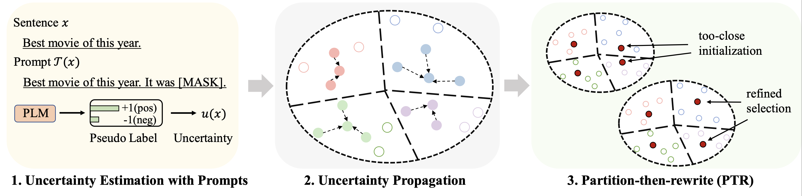

# Patron
This repo contains the code for our ACL 2023 paper [Cold-Start Data Selection for Few-shot Language Model Fine-tuning: A Prompt-Based Uncertainty Propagation Approach](https://arxiv.org/abs/2209.06995).

## Model Framework


## Performance
The results on different datasets (using 128 labels as the budget) for fine-tuning are summarized as follows:

| Method |  IMDB | Yelp-full | AGNews | Yahoo! | DBPedia | TREC | Mean|
| ------ | ------- | ----- | ----------- | ------- | -------- | --------| ------- | 
| Full Supervision (RoBERTa-base)  | 94.1 | 66.4 | 94.0 | 77.6 | 99.3 | 97.2 | 88.1 
| Random Sampling | 86.6 | 47.7 | 84.5 | 60.2 | 95.0 | 85.6 | 76.7 
| Best Baseline [(Chang et al. 2021)](https://aclanthology.org/2021.acl-short.2/) | 88.5 | 46.4 | 85.6 | 61.3 | 96.5 | 87.7 | 77.6
| Patron (Ours) | 89.6 | 51.2 | 87.0 | 65.1 | 97.0 | 91.1 | 80.2 


For prompt-based learning, we use the same pipeline as the [LM-BFF](https://aclanthology.org/2021.acl-long.295/). The result with 128 labels is shown as follows.
| Method |  IMDB | Yelp-full | AGNews | Yahoo! | DBPedia | TREC | Mean|
| ------ | ------- | ----- | ----------- | ------- | -------- | --------| ------- | 
| Full Supervision (RoBERTa-base)  | 94.1 | 66.4 | 94.0 | 77.6 | 99.3 | 97.2 | 88.1 
| Random Sampling | 87.7 | 51.3 | 84.9 | 64.7 | 96.0 | 85.0 | 78.2 
| Best Baseline [(Yuan et al., 2020)](https://aclanthology.org/2020.emnlp-main.637/) | 88.9 | 51.7 | 87.5 | 65.9 | 96.8 | 86.5 | 79.5
| Patron (Ours) | 89.3 | 55.6 | 87.8 | 67.6 | 97.4 | 88.9 | 81.1 

## Dependencies
```
python 3.8
transformers==4.2.0
pytorch==1.8.0
scikit-learn
faiss-cpu==1.6.4
sentencepiece==0.1.96
tqdm>=4.62.2
tensorboardX
nltk
openprompt
```

## Datasets
We use the following four datasets for the main experiments.
|   Dataset   | Task  | Number of Classes | Number of Unlabeled Data/Test Data|
|---------------- | -------------- |-------------- | -------------- |
| [IMDB](https://huggingface.co/datasets/imdb)       |     Sentiment           |     2   |  25k/25k  |
| [Yelp-full](https://github.com/yumeng5/WeSHClass)       |     Sentiment           |     5   |  39k/10k  |
| [AG News](https://huggingface.co/datasets/ag_news) |    News Topic       |      4      |  119k/7.6k   |
| [Yahoo! Answers](https://huggingface.co/datasets/yahoo_answers_topics)  |  QA Topic  |     5        |     180k/30.1k    |
| [DBPedia](https://huggingface.co/datasets/dbpedia_14)     |     Ontology Topic      |      14      |     280k/70k      |
| [TREC](https://huggingface.co/datasets/trec)     |     Question Topic      |      6      |     5k/0.5k      |

The processed data can be found at [this link](https://drive.google.com/drive/folders/1qSGGxVlxmy1-T1RLDlwGlGHKrw2kEKKm?usp=sharing). The folder to put these datasets will be discribed in the following parts.

## Data Selection Pipeline
### a) Generating Unsupervised Text Embeddings via SimCSE
Run the following commands
```
python gen_embedding_simcse.py --dataset [the dataset you use] --gpuid [the id of gpu you use] --batchsize [the number of data processed in one time]
```

### b) Estimating Uncertainty via Prompts
We provide the *pseudo prediction* obtained via prompts in the above link for datasets. Please refer to the original papers for details. 

### c) Data Selection with Uncertainty Propagation and PTR
Run the following commands (example on AG News dataset)
```
python patron_sample.py --dataset agnews --k 50 --rho 0.01 --gamma 0.5 --beta 0.5
```
Some important hyperparameters:
- `rho`: the parameter used for uncertainty propagation in Eq. 6 of the paper 
- `beta`: the regularization of distance in Eq. 8 of the paper 
- `gamma`: the weight of the  regularization term in Eq. 10 of the paper

## Experiments
### Running Fine-tuning Experiments
See `finetune` folder for detailed instructions.


### Running Prompt-based Learning Experiments
See `prompt_learning` folder for detailed instructions.


## Running on a New Dataset

See [this link](https://github.com/thunlp/OpenPrompt/blob/ca27491101df0108a8dd753e5b1e79bf591f65d3/docs/source/notes/examples.rst#introduction-with-an-example) as the pipeline for generating the prompt-based predictions. Note that you need to customize your prompt verbalizers and templates.

To generate the document embeddings, you can follow the above commands by using SimCSE. 

Once you generate the index for the selected data, then you can use the pipelines in `Running Fine-tuning Experiments` and `Running Prompt-based Learning Experiments` for the few-shot fine-tuning and prompt-based learning experiments. 

## Citation
Please kindly cite the following paper if you find this repo helpful for your research. Thanks in advance!

```
@article{yu2022patron,
  title={Cold-Start Data Selection for Few-shot Language Model Fine-tuning: A Prompt-Based Uncertainty Propagation Approach
},
  author={Yue Yu and Rongzhi Zhang and Ran Xu and Jieyu Zhang and Jiaming Shen and Chao Zhang},
  journal={arXiv preprint arXiv:2209.06995},
  year={2022}
}
```
## Acknowledgements 
We would like to thank the authors from the repo [SimCSE](https://github.com/princeton-nlp/SimCSE) and [OpenPrompt](https://github.com/thunlp/OpenPrompt) for the well-organized code.
